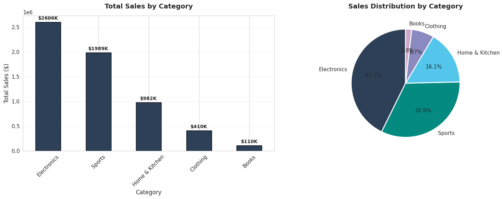
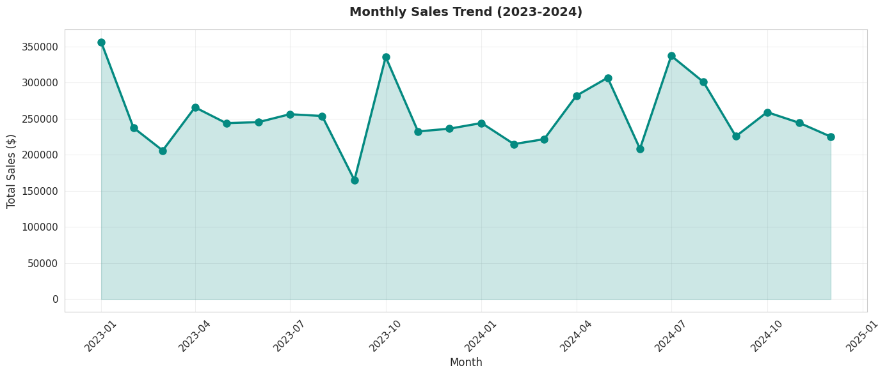
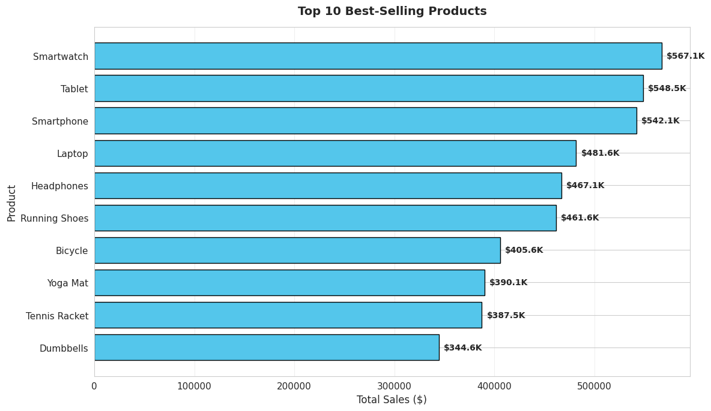
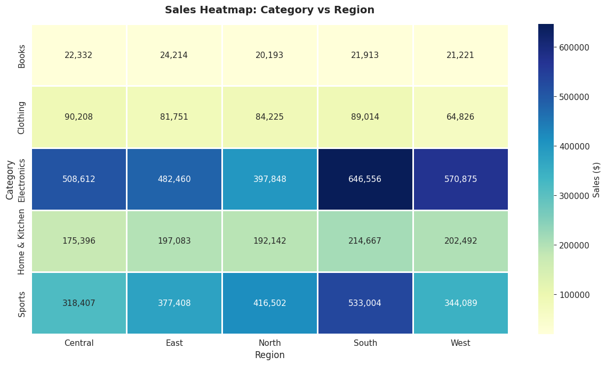

# Sales
> Comprehensive data analysis project on e-commerce sales data (2,500+ transactions) using Python. The project covers the full data analysis pipeline: from cleaning raw data, through exploratory analysis, to extracting actionable business insights.
# 📊 E-commerce Sales Data Analysis


> Comprehensive data analysis project on e-commerce sales data (2,500+ transactions) using Python. The project covers the full data analysis pipeline: from cleaning raw data, through exploratory analysis, to extracting actionable business insights.

---

## 🎯 Project Objectives

- Clean and prepare messy real-world sales data for analysis
- Perform comprehensive Exploratory Data Analysis (EDA)
- Identify top-performing products, categories, and regions
- Analyze customer segments and purchasing patterns
- Evaluate the impact of discounts on profitability
- Provide data-driven recommendations for business decisions

---

## 📁 Project Structure

```
sales-analysis/
│
├── Sales_Analysis.ipynb          # Main analysis notebook
├── generate_data.py              # Script to generate sample data
├── run_analysis.py               # Standalone analysis script
├── sales_data_raw.csv            # Original messy dataset
├── sales_data_cleaned.csv        # Cleaned final dataset
├── images/                       # Generated visualizations
│   ├── 01_sales_by_category.png
│   ├── 02_monthly_trend.png
│   ├── 03_top_products.png
│   ├── 04_sales_by_region.png
│   ├── 05_heatmap.png
│   ├── 06_discount_impact.png
│   └── 07_segment_analysis.png
├── requirements.txt              # Project dependencies
└── README.md                     # Project documentation
```

---

## 🛠️ Tools & Libraries

| Tool | Purpose |
|------|---------|
| **Python 3.9+** | Core programming language |
| **Pandas** | Data manipulation and analysis |
| **NumPy** | Numerical computations |
| **Matplotlib** | Static visualizations |
| **Seaborn** | Statistical visualizations |
| **Jupyter Notebook** | Interactive development |

---

## 🧹 Data Cleaning Process

The raw dataset contained several real-world data quality issues:

| Issue | Count | Resolution |
|-------|-------|------------|
| Duplicate rows | 23 | Removed using `drop_duplicates()` |
| Missing values (Customer_Segment) | 30 | Filled with mode |
| Missing values (Region) | 25 | Filled with mode |
| Missing values (Shipping_Mode) | 25 | Filled with mode |
| Inconsistent date formats | 50 | Unified to `YYYY-MM-DD` |
| Inconsistent text capitalization | 40 | Standardized to Title Case |

**Result:** Clean dataset of 2,502 rows with 19 columns (added derived features).

---

## 📈 Key Findings

### Performance Metrics
- **Total Sales:** $6.09M
- **Total Profit:** $1.19M
- **Profit Margin:** 19.68%
- **Unique Customers:** 493
- **Total Orders:** 2,502

### Top Insights

**1. Electronics Dominate Sales**  
The Electronics category accounts for 42.7% of total sales, followed by Sports (32.6%). These two categories drive 75% of the business revenue.

**2. Seasonal Patterns**  
Sales show clear peaks in January and July, with dips in September. This pattern suggests opportunities for targeted seasonal campaigns.

**3. Regional Performance**  
The South region leads in sales, particularly in Electronics. This indicates either higher demand or better market penetration in that area.

**4. Discount Impact**  
Higher discount rates (20–25%) significantly reduce profit margins despite slightly boosting sales volume. A revised discount strategy could improve overall profitability.

**5. Customer Segments**  
The Consumer segment generates the highest total sales, but Corporate customers have higher average order values, making them valuable for targeted B2B campaigns.

---

## 📊 Visualizations

### Sales by Category


### Monthly Sales Trend


### Top 10 Best-Selling Products


### Sales Heatmap: Category vs Region


---

## 💡 Business Recommendations

1. **Inventory Focus:** Prioritize stocking Electronics and Sports products, as they drive 75% of revenue.
2. **Discount Strategy:** Reduce reliance on high discounts (20%+) that erode profit margins.
3. **Regional Expansion:** Investigate why underperforming regions have lower sales and develop targeted strategies.
4. **Seasonal Planning:** Prepare marketing campaigns ahead of January and July peaks.
5. **Customer Retention:** Develop loyalty programs for the Consumer segment, which drives the highest volume.

---

## 🚀 How to Run

### Prerequisites
```bash
Python 3.9 or higher
```

### Installation
```bash
# Clone the repository
git clone https://github.com/yourusername/sales-analysis.git
cd sales-analysis

# Install dependencies
pip install -r requirements.txt
```

### Run the Analysis
```bash
# Option 1: Run the Jupyter Notebook
jupyter notebook Sales_Analysis.ipynb

# Option 2: Run the standalone script
python run_analysis.py
```

---

## 📋 Requirements

```
pandas>=2.0.0
numpy>=1.24.0
matplotlib>=3.7.0
seaborn>=0.12.0
jupyter>=1.0.0
```

---

## 👤 About the Developer

**[Mennatullah Mourad]**  
Data Analyst | Python Developer  
Specialized in Data Cleaning, Analysis, and Visualization

📧 Contact: mennamourad963a2gmail.com 
🔗 LinkedIn: [www.linkedin.com/in/mennatullah-mourad-13384b36a]

---

## 📄 License

This project is licensed under the MIT License - feel free to use it as a reference for your own projects.

---
⭐ **If you found this project helpful, please consider giving it a star!**

